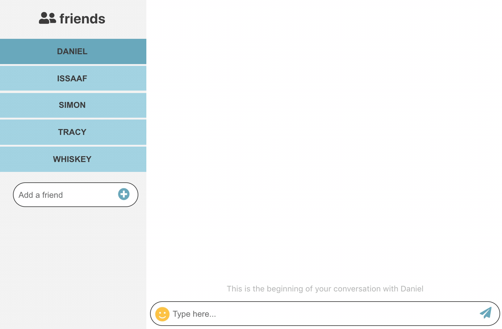

# React Chat App

A small chat application created with React.
Deployed version can be found [here](https://github.com/jumboduck/react-chat-app).

## Features

-   User can write messages in a window and see them appear
-   User can select between friends to see related conversation
-   User can add a new friend to his friends list
-   Emojis can be included in the message
-   Automatically generated response to messages
-   Fully responsive

## Technology

-   Application made with [Create React App](https://create-react-app.dev/)
-   Emoji selector from [emoji-picker-react](https://www.npmjs.com/package/emoji-picker-react)
-   Icons from [Fontawesome](https://fontawesome.com/)
-   Random responses use the [randomtext.me API](https://www.randomtext.me/)
